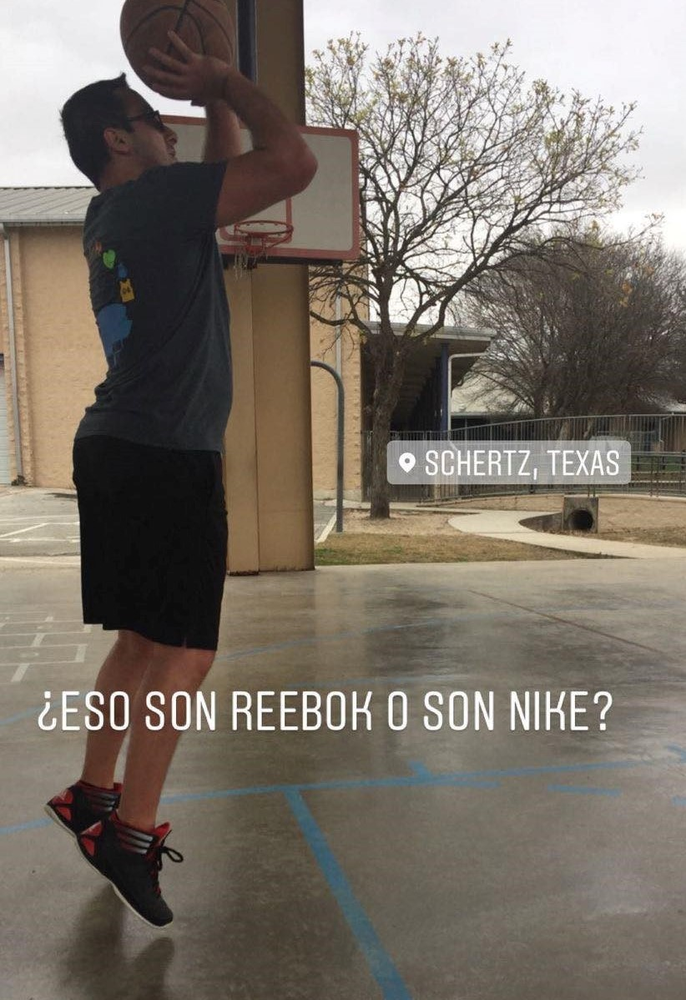

```{r setup, include=FALSE}
knitr::opts_chunk$set(echo = FALSE)
```

### Honors and Awards

- Judith Liebman Award (2021) \
- George Family Foundation Fellowship (2019) \
- Goizueta Foundation Fellowship (2016-2018) \
- UT Austin EOE Academic Leaders Hall of Fame (2016) \
- UT Engineering Honors Program (2012-2016) \
- Virginia \& Ernest Cockrell, Jr. Scholarship in Engineering  (2012-2016)

### Personal Interests

I enjoy watching and playing just about every sport you can name. I am remarkably average at most of them. I like to pretend that I have refined tastes in television shows, movies, craft beer, and classical music, but I really do not. Anyone could call me out on this and immediately deduce that I am a fraud when it comes to these things.

```{r, echo=FALSE, out.width="50%", out.height="50%", fig.align="center"}

```

