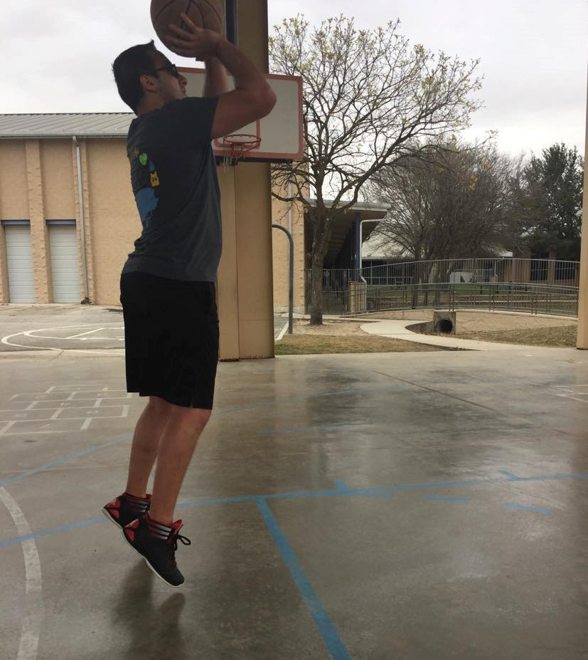

```{r setup, include=FALSE}
knitr::opts_chunk$set(echo = FALSE)
```

### Honors and Awards

- [INFORMS Student Chapter at Georgia Tech](https://sites.gatech.edu/informs-isye/) \
-- Judith Liebman Award (2021) \
-- Magna Cum Laude Student Chapter (Social Media Chair, 2021) \
-- Cum Laude Student Chapter (President, 2020)
- George Family Foundation Fellowship (2019) \
- Goizueta Foundation Fellowship (2016-2018) \
- UT Austin EOE Academic Leaders Hall of Fame (2016) \
- UT Engineering Honors Program (2012-2016) \
- Virginia \& Ernest Cockrell, Jr. Scholarship in Engineering  (2012-2016)

### Interests

I enjoy watching and playing just about every sport you can name. I am remarkably average at some of them. I like to pretend that I have refined tastes in television shows, movies, craft beer, and classical music, but I really do not. Anyone could call me out on this and immediately deduce that I am a fraud when it comes to these things.

```{r, echo=FALSE, out.width="50%", out.height="50%", fig.align="center"}

```

The following are some of my favorite childhood pictures (and no, I cannot tell the difference between [Tony](https://tonyelhabr.rbind.io/about.html) and me):

```{r, echo=FALSE, out.width="50%", out.height="50%", fig.align="center"}
knitr::include_graphics(c("baby-halloween.jpg", "schertz-twins.jpg", "lebanon-twins-1.jpg",
                          "lebanon-twins-2.jpg", "child-camel.jpg", "baby-texas.jpg"))
```
